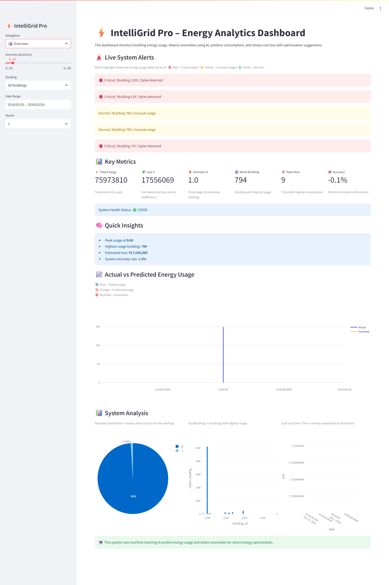
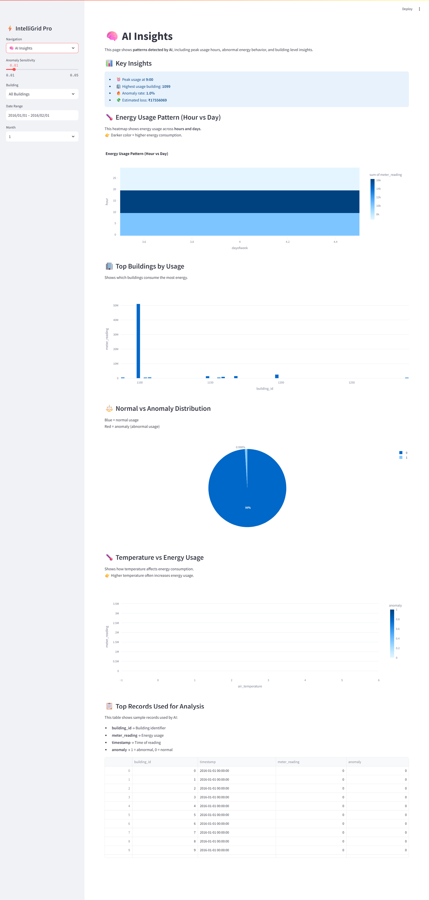
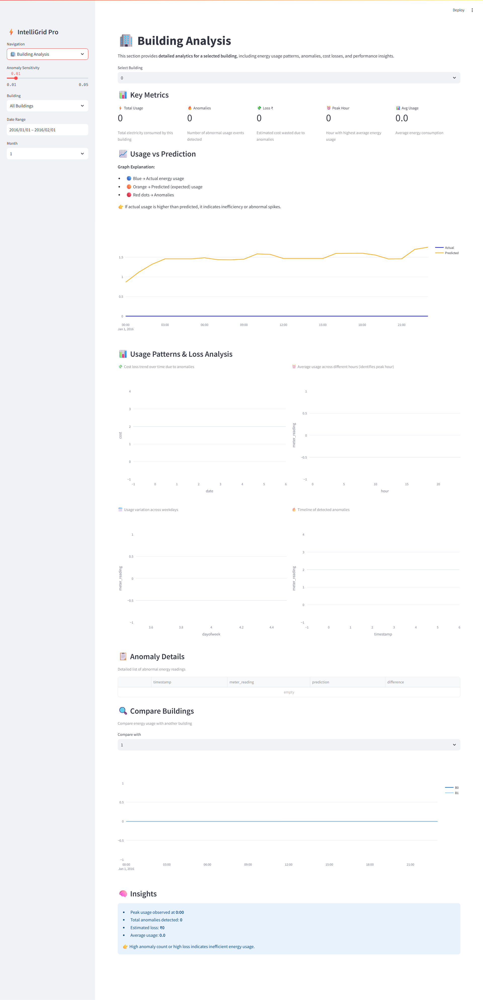
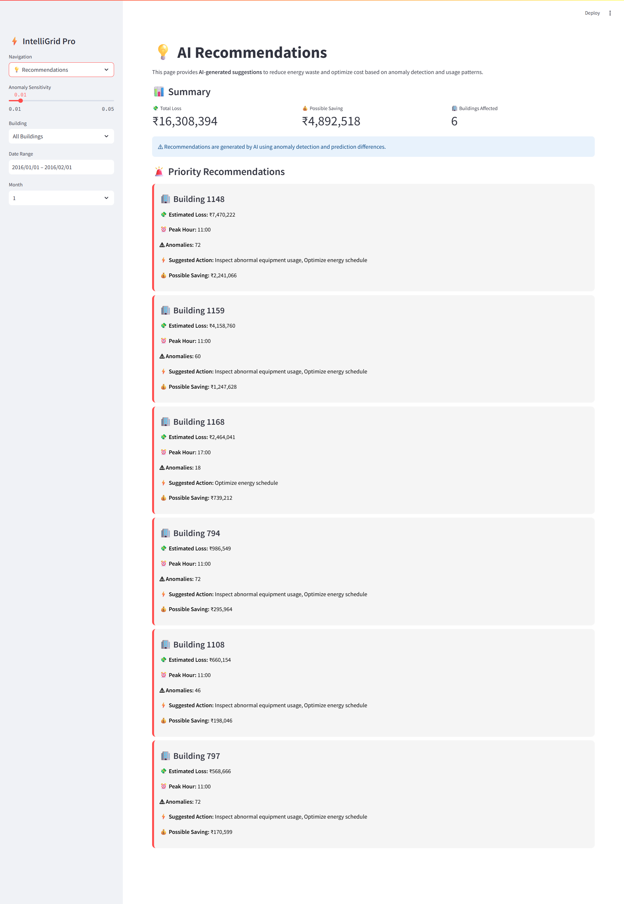
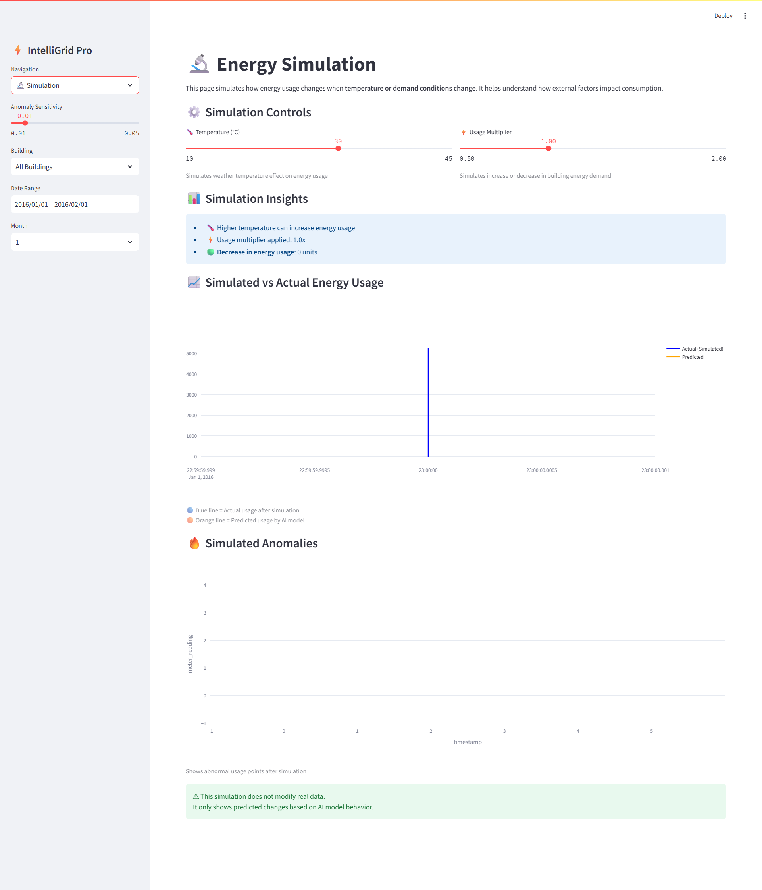
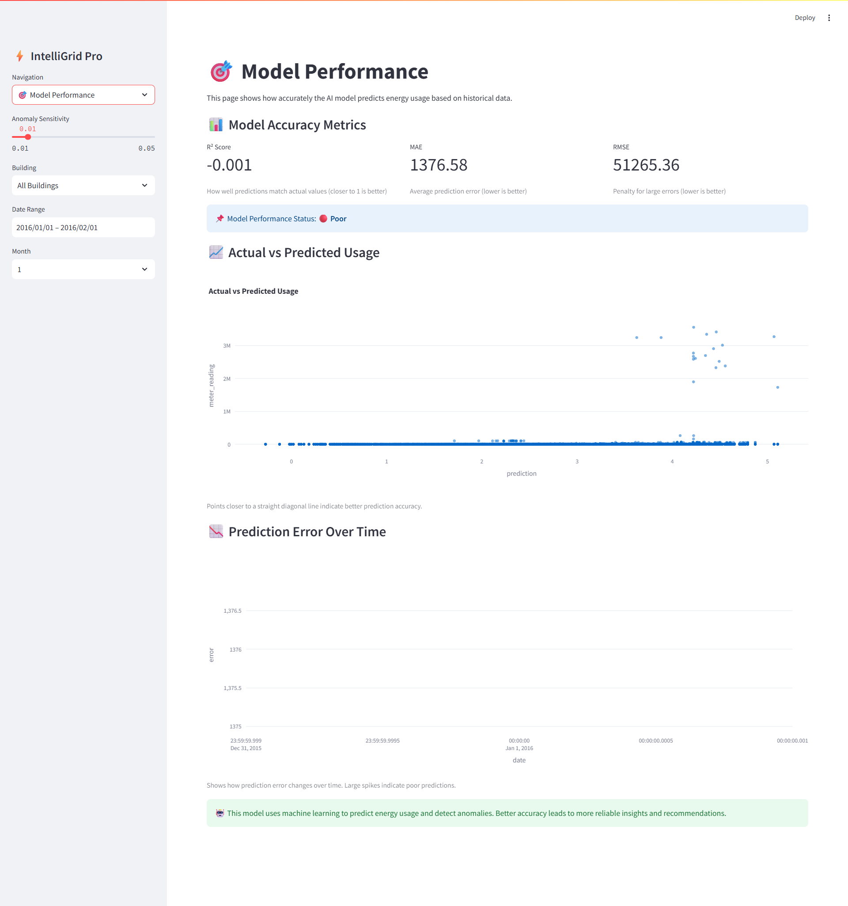
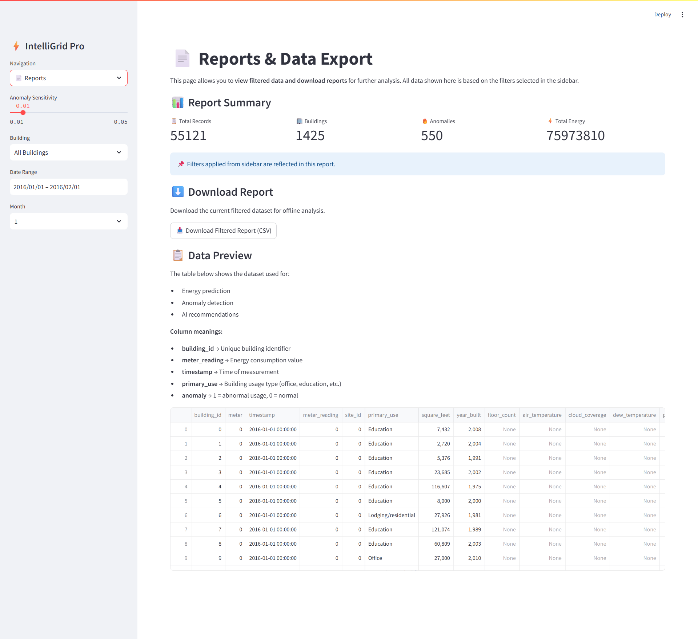
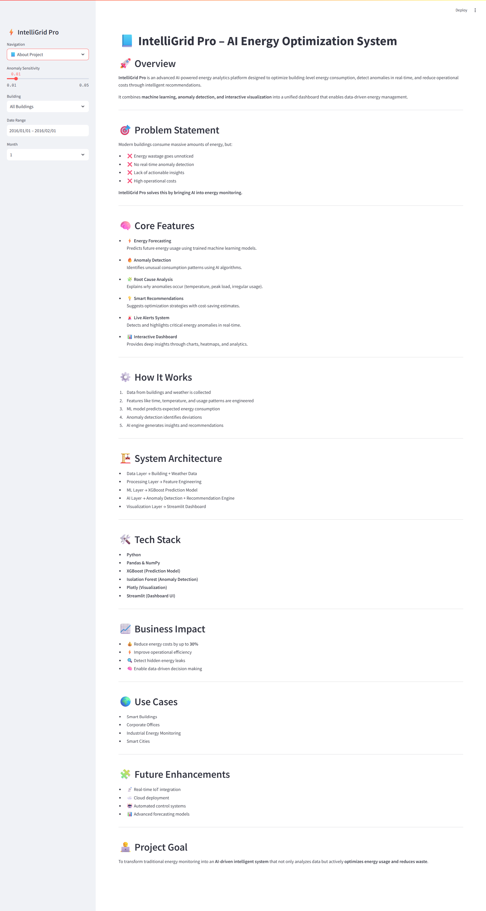

# ⚡ IntelliGrid Pro – AI Energy Forecasting & Anomaly Detection

> **Predict. Detect. Optimize.**
> An intelligent energy analytics platform built to reduce energy waste and optimize building performance using AI.

---

## 🚀 What is IntelliGrid Pro?

**IntelliGrid Pro** is a full-stack AI-powered energy monitoring and optimization system that analyzes building energy usage, predicts future consumption, detects anomalies in real-time, and provides actionable cost-saving recommendations.

It transforms raw energy data into **clear decisions, alerts, and insights**.

---

## 🎯 Why this project matters

Energy inefficiency is a massive hidden problem.

- ❌ Buildings waste energy without detection  
- ❌ No real-time anomaly identification  
- ❌ High operational costs  
- ❌ No actionable insights  

👉 IntelliGrid Pro solves this by bringing **AI-driven intelligence into energy monitoring**.

---

## 🧠 Core Capabilities

### 🔮 Energy Forecasting
- Predicts expected energy usage using **XGBoost**
- Learns patterns from time, weather, and building data

### 🔥 Anomaly Detection
- Detects abnormal energy spikes using **Isolation Forest**
- Identifies inefficiencies in real-time

### 🚨 Smart Alert System
- Flags critical and warning-level anomalies
- Helps prioritize energy issues instantly

### 💡 AI Recommendation Engine
- Suggests actions like load shifting, HVAC optimization
- Estimates **potential cost savings**

### 🔬 Simulation Engine
- Simulates energy behavior under:
  - Temperature changes
  - Demand changes
- Shows impact before real-world implementation

### 📊 Interactive Dashboard
- Built with **Streamlit + Plotly**
- Clean, intuitive, and industry-style UI

---

## 🖥️ Dashboard Overview

| Page | Description |
|------|------------|
| 📊 Overview | System KPIs, alerts, energy trends |
| 🏢 Building Analysis | Deep dive into individual building performance |
| 🧠 AI Insights | Patterns, heatmaps, anomaly analysis |
| 💡 Recommendations | AI-generated cost-saving actions |
| 🎯 Model Performance | ML evaluation metrics |
| 🔬 Simulation | Scenario-based energy prediction |
| 📄 Reports | Exportable data & summaries |

---

## ⚙️ Tech Stack

| Layer | Technology |
|------|-----------|
| Data Processing | Pandas, NumPy |
| Machine Learning | XGBoost |
| Anomaly Detection | Isolation Forest |
| Visualization | Plotly |
| Frontend | Streamlit |

---

## 🧪 How it Works

1. 📥 Load building + weather data  
2. 🧠 Feature engineering (time, temp, usage patterns)  
3. 🔮 Predict energy usage using ML model  
4. 🔥 Detect anomalies (deviation from prediction)  
5. 💡 Generate insights & recommendations  
6. 📊 Visualize everything in dashboard  

---

## 📈 Business Impact

- 💰 Reduce energy costs by up to **30%**
- 🔍 Detect hidden inefficiencies
- ⚡ Improve operational efficiency
- 🧠 Enable data-driven decision making

---

## ▶️ How to Run

```bash
pip install -r requirements.txt
streamlit run app.py


## 📷 Demo & Screenshots

## 📷 Demo & Screenshots

### 📊 Overview Dashboard


### 🧠 AI Insights


### 🏢 Building Analysis


### 💡 AI Recommendations


### 🔬 Energy Simulation


### 🎯 Model Performance


### 📄 Reports


### 📘 About Project

---

## 🚀 Future Enhancements

- 📡 Real-time IoT integration  
- ☁️ Cloud deployment (AWS/GCP)  
- 🤖 Automated energy control  
- 📊 Advanced deep learning models  


---

## 👨‍💻 Author

**Sathvik**  
B.Tech Data Science